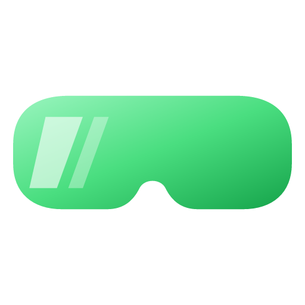
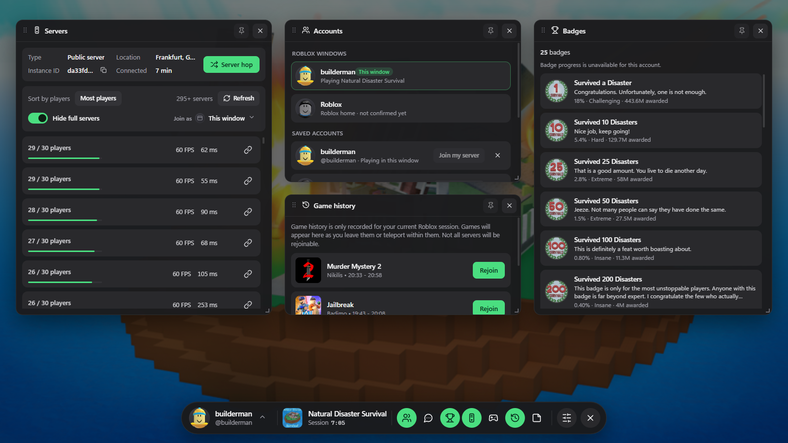

<p align="center">
  
</p>

<h1 align="center">Visor</h1>

<p align="center">
  <b>The in-game overlay for Roblox.</b><br>
  Server browser, server hop, badges, game history, notes, messages and multi-account, one hotkey away.
</p>

<p align="center">
  <a href="https://github.com/AeroUp/Visor/releases/latest"></a>
  <a href="https://github.com/AeroUp/Visor/releases"></a>
  
  <a href="LICENSE"></a>
</p>

<p align="center">
  
</p>

## Download

1. Grab **`Visor-Setup-x.y.z.exe`** from the [latest release](https://github.com/AeroUp/Visor/releases/latest) and run it. It installs just for you, so no admin rights are needed.
2. Open Roblox and press **`** (the key under Esc) to bring up the overlay.

Visor updates itself: new versions download in the background and install when you restart it.

> **Windows SmartScreen warning?** Visor isn't code-signed yet (certificates cost hundreds a year), so Windows may say it's from an unknown publisher. Click **More info → Run anyway**. Every release is built from this repo by [GitHub Actions](../../actions), so you can check exactly what's in it.

## What's in it

| Widget | What it does |
| --- | --- |
| **Servers** | Your server's type, ID, location and time connected. The full public server list, with sorting, hide-full, FPS and ping. Join, copy an invite link, or **Server hop**. |
| **Accounts** | Which account is in each Roblox window, your saved accounts, **Join my server**, **Add account**, and the multi-instance switch. |
| **Badges** | Every badge in the game you're in, with rarity and difficulty, and which ones you own. |
| **Game history** | Every game and server you visited this session, with **Rejoin**. |
| **Games** | Search Roblox experiences or browse your favorites, then click to join. |
| **Messages** | Read and reply to your Roblox chats. |
| **Notes** | A notepad that saves as you type. |
| **Settings** | Hotkey, dim amount, server toasts, start with Windows, sign in and out. |

The bar along the bottom shows your profile, the game you're in and a session timer. Drag widgets by their header, resize them from the corner, and **pin** one to keep it on screen while the overlay is closed. When you join a server, a "Connected to public server · Location" toast pops up.

## Is it safe? Can I get banned?

- **Nothing is injected into Roblox.** Visor is a separate, click-through window that sits on top of the Roblox window, like the Discord or Steam overlay. It never touches the game's memory or files.
- **It learns what you're playing from Roblox's own log files.** That's the same method Bloxstrap and Fishstrap use.
- **Everything else comes from Roblox's public web APIs.** That's the same data roblox.com shows you.
- **Signing in is optional.** It's only needed for Messages, badge ownership, online status and multiple accounts. It happens on **roblox.com's own login page** in a separate window, so Visor never sees your password. Each account keeps its own cookie jar on your PC, encrypted by Windows, and Visor only ever sends it to roblox.com.
- **It's open source.** Read the code, or build it yourself (see below).

No third-party tool can promise anything about Roblox's rules, but Visor only does what an overlay and a web browser do.

## Upgrading from Fishlay

Close Fishlay before the first launch of Visor. If Visor has no `visor.json` yet, it copies Fishlay's settings, notes, saved account list and session partitions, leaving Fishlay's data untouched. Existing Visor settings and partitions are preserved. You may need to sign in again if a copied session has expired or cannot be decrypted.

If copying fails, Visor exits without saving default settings so the migration can be retried. Close Fishlay and relaunch Visor. If you already launched an older Visor build and only see defaults, close both apps and back up both `%APPDATA%\Fishlay` and `%APPDATA%\Visor` before renaming Visor's `visor.json` to `visor.json.backup` and launching the updated build. Do this only if you want to replace those Visor settings with Fishlay's settings; keep the backups until you have checked the result.

## Multiple accounts

- **Detection:** every Roblox window writes its own log, so Visor works out which account is in which window. The bar and widgets follow whichever window you're in, even after an in-app account switch.
- **Add account:** opens roblox.com's login in its own window. Accounts never share cookies.
- **Join as:** in Games, Servers and Game history, pick which account joins. *This window* switches the game in your current window; a saved account opens Roblox signed in as that account, using the same launch ticket roblox.com's Play button uses. **Join my server** sends a second account into your server.
- **Multiple Roblox windows:** a switch in the Accounts widget lets each account keep its own window. It takes effect once every Roblox window has been closed once.

## Privacy

- Visor keeps everything on your PC, in `%APPDATA%\Visor`: settings, notes, saved accounts and a small diagnostic log (`visor.log`).
- It talks to only three places:
  - **Roblox:** its web APIs and roblox.com.
  - **ipinfo.io:** it sends your server's IP address only, to show the server location.
  - **GitHub:** to check for updates.
- There are no analytics and no tracking.

## Tips

- **Change the hotkey** in Settings. You can also bind `Visor.exe --toggle` to a mouse button or macro key.
- **Esc** closes the overlay.
- **Something broke?** Open an [issue](../../issues/new/choose) and attach `%APPDATA%\Visor\visor.log`.

## Limits

- Roblox doesn't publish server uptime or region per server, so you get *time connected* and no region filter.
- **Messages**, **online status** and **launching as a saved account** use Roblox endpoints that aren't officially documented. If Roblox changes them, only those features stop working; the rest of the overlay is unaffected.

## Build it yourself

You need Node.js 20+ and Windows.

```bash
npm install
npm start            # run from source
npm run preview      # UI in your browser with live data at http://localhost:5178 (--demo for stand-in data)
npm run dist         # installer + zip in release/
npm run icons        # re-render icons from assets/logo.svg
```

```
src/main/main.js         overlay window, focus/hotkey, tray, IPC, updates
src/main/win32.js        Win32 bindings via koffi: Roblox windows, focus, multi-instance
src/main/logwatcher.js   Roblox log parser: current game + session history
src/main/roblox-api.js   Roblox web API client (public + signed-in)
src/main/accounts.js     saved accounts, one private session each
src/renderer/            the overlay UI: plain JS, no build step
tools/                   preview server, screenshots, icon renderer, checks
```

Releases are built and published by GitHub Actions when a `v*` tag is pushed.

## Credits

The overlay's look and feel was inspired by Fishstrap's in-game overlay. Visor is an independent project, and it isn't affiliated with Roblox Corporation, Bloxstrap or Fishstrap.

MIT © Aero
